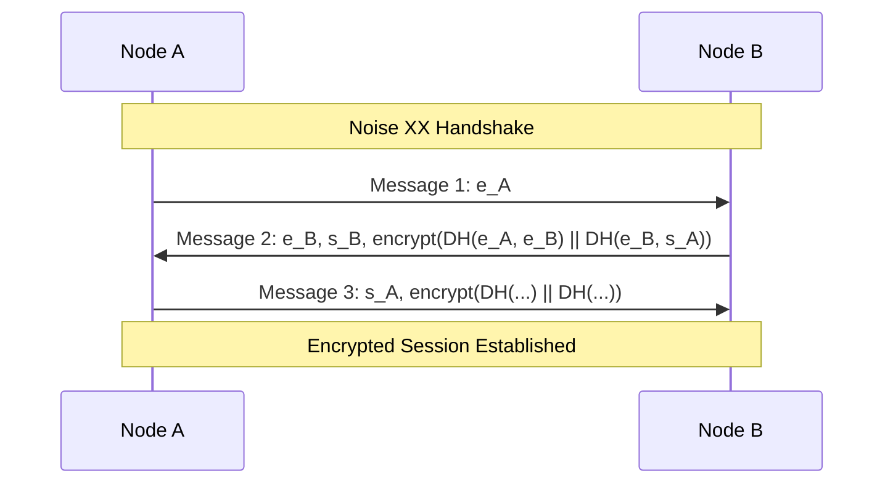
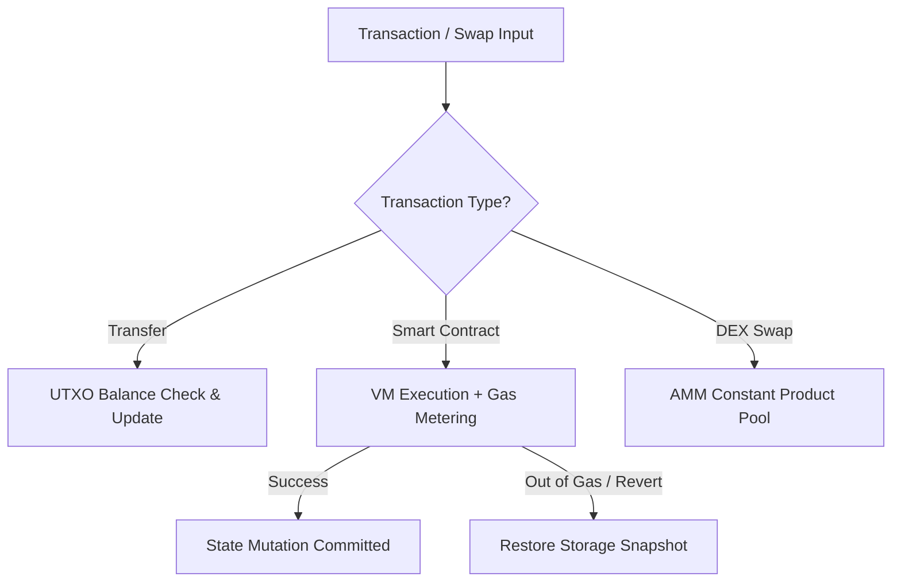
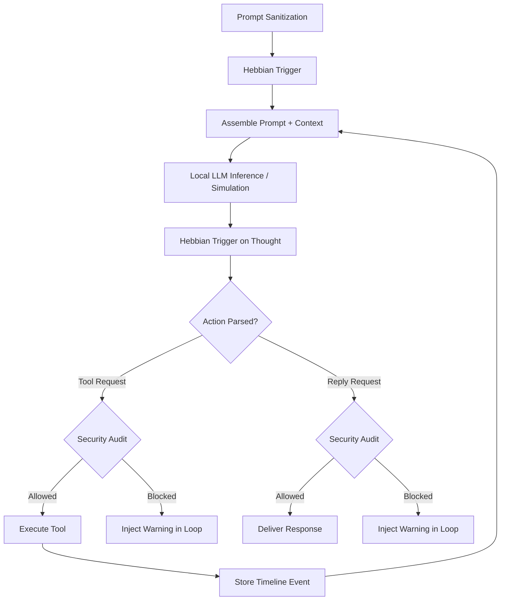

# ErnosDecent System Guide Synthesis

This document provides a comprehensive technical guide to the ErnosDecent decentralized codebase, detailing the purpose, operational flows, database/persistence schemas, APIs, and key mathematical formulas and algorithms for a selection of the core subsystems. (ErnosDecent comprises 17 subsystems in total; this synthesis covers the nine detailed below. For TTS and the wider AI/agent surface, see the AI guide and `book/notes/system-bible.md`.)

---

## 1. decent_net (Kademlia DHT, Transport Layer, & Peer Discovery)

### Core Purpose & Operational Flow
The networking layer provides structured peer-to-peer overlay routing, peer discovery, and secure transport. Nodes communicate over TCP/IP secured via a **Noise XX handshake** to achieve end-to-end encrypted tunnels. Discovery and routing are organized around a **Kademlia DHT (Distributed Hash Table)**, which allows key-value storage and efficient node lookup in $O(\log N)$ steps.

### Database & File Persistence Schema
Primary network and routing states are persisted in `node.db` via `storage.ep`:
*   **`dht_peers` Table**: Stores known remote nodes for routing buckets.
    *   `node_id` (TEXT PRIMARY KEY) — The 256-bit Node ID.
    *   `address` (TEXT NOT NULL) — IP address/host.
    *   `port` (INTEGER NOT NULL) — TCP port.
    *   `last_seen` (INTEGER) — Unix timestamp of the last successful communication.
*   **`dht_values` Table**: Persists DHT key-value entries published locally or republished by peers.
    *   `key` (TEXT PRIMARY KEY) — The SHA-256 hash or descriptor string.
    *   `value` (TEXT NOT NULL) — Stored string payload.
    *   `publisher` (TEXT) — DID of the publisher.
    *   `stored_at` (INTEGER) — Unix timestamp of publication.
    *   `expires_at` (INTEGER) — Expiration timestamp.

### Key APIs & Protocol Commands
*   `dht_rpc_ping(dht, addr, port)`: Sends a ping to verify a node is active.
*   `dht_rpc_store(dht, addr, port, key, value)`: Instructs a remote node to store a key-value pair.
*   `dht_rpc_find_node(dht, addr, port, target_id)`: Requests the $k$-closest nodes to a target ID.
*   `dht_rpc_find_value(dht, addr, port, key)`: Queries a node for a value; returns the value or a list of $k$-closest nodes.
*   `dht_node_bootstrap(dht, seed_addr, seed_port)`: Initiates routing table setup by looking up own ID.

### Key Mathematical Formulas & Algorithms
*   **XOR Distance Metric**: Kademlia's distance metric $d(x, y)$ between two 256-bit identifiers $x$ and $y$ is the bitwise exclusive-OR (XOR) interpreted as an integer:
    $$d(x, y) = x \oplus y$$
    This is evaluated byte-by-byte in `dht_distance` (from most significant byte to least).
*   **Bucket Splitting**: The routing table consists of $k$-buckets where $k=20$. Buckets cover binary prefixes of the distance space:
    $$\text{Bucket Range } i \in [0, 255] \implies \text{Distance } d \in [2^i, 2^{i+1}-1]$$

---

## 2. decent_consensus (Raft Consensus & Log Rollbacks)

### Core Purpose & Operational Flow
Ensures distributed consensus for state changes (ledger transfers, DEX pool state, and name registrations). It implements the **Raft Consensus Protocol**, electing a single leader that coordinates log replication across the network. If a follower's uncommitted log is truncated to match the leader's history, the follower uses a built-in **undo stack state rollback** mechanism to safely revert its state machine.

### Database & File Persistence Schema
Log persistence leverages the underlying SQLite structure:
*   **`ledger_blocks` Table** (acts as the replicated state log):
    *   `block_index` (INTEGER PRIMARY KEY) — Index of the block (Log Index).
    *   `prev_hash` (TEXT) — Cryptographic hash of the previous block.
    *   `block_hash` (TEXT) — Hash of the current block.
    *   `validator` (TEXT) — Block generator / leader signature.
    *   `timestamp` (INTEGER) — Block generation timestamp.
    *   `tx_count` (INTEGER) — Number of operations.
    *   `data` (TEXT) — JSON-serialized list of log entries / transactions.

### Key APIs & Protocol Commands
*   `raft_request_vote(raft, term, candidate_id, last_log_index, last_log_term)`: RequestVote RPC handler.
*   `raft_append_entries(raft, term, leader_id, prev_log_index, prev_log_term, entries, leader_commit)`: AppendEntries RPC handler.
*   `state_apply_operation(state, op)`: Executes log entry operations (e.g. `SET`, `ADD`, `SUB`, `DEL`) on the state machine.
*   `state_rollback_log(state, target_index)`: Rolls back applied operations down to `target_index`.

### Key Mathematical Formulas & Algorithms
*   **Quorum Size**: Operations are committed only when replicated on a majority of nodes:
    $$Q = \lfloor N/2 \rfloor + 1$$
*   **Undo Stack Rollbacks**: For each mutated state key, the follower records the inverse operation on a `state_rollback_log` stack:
    $$\begin{aligned}
    \text{Forward } \operatorname{SET}(k, v) &\implies \text{Undo } \operatorname{SET}(k, v_{\text{old}}) \\
    \text{Forward } \operatorname{ADD}(k, x) &\implies \text{Undo } \operatorname{SUB}(k, x) \\
    \text{Forward } \operatorname{SUB}(k, x) &\implies \text{Undo } \operatorname{ADD}(k, x) \\
    \text{Forward } \operatorname{DEL}(k) &\implies \text{Undo } \operatorname{SET}(k, v_{\text{old}})
    \end{aligned}$$
    When the leader instructs a truncation, the state machine rolls back by iterating backwards through the undo log to restore original values.

---

## 3. decent_money (UTXO Ledger, DEX AMM, & Smart Contracts)

### Core Purpose & Operational Flow
Provides a token economy with UTXO-style settlement, an AMM constant product pool integrated with a price-priority limit orderbook matching engine, and a stack-based Smart Contract VM with gas metering.

### Database & File Persistence Schema
*   **`ledger_utxo` Table**: Maintains ledger balances for settlement.
    *   `address` (TEXT NOT NULL) — Ledger address/DID.
    *   `amount` (INTEGER NOT NULL) — Token balance in microunits ($1 \text{ token} = 1,000,000 \text{ microunits}$).
*   **`contracts` Table** (Managed dynamically by smart contracts):
    *   `contract_address` (TEXT PRIMARY KEY) — Contract hash.
    *   `bytecode` (TEXT) — Compiled stack-based VM instructions.
    *   `storage` (TEXT) — JSON-serialized KV pair store for VM state variables.

### Key APIs & Protocol Commands
*   `WALLET BALANCE`: Command to query current address UTXO balances.
*   `MONEY TRANSFER <amount> <recipient>`: Prepares and settles a token transfer transaction.
*   `MONEY SWAP <from_token> <to_token> <amount>`: Submits swap request to AMM or orderbook.
*   `vm_execute(contract, code, args, gas_limit)`: Initiates smart contract evaluation.

### Key Mathematical Formulas & Algorithms
*   **Constant Product Market Maker**: Swaps follow the constant product invariant formula:
    $$x \times y = k$$
    For token inflow $\Delta x$ (applying a pool fee fraction $\gamma = 0.003$), the outflow $\Delta y$ received by the swapper is calculated as:
    $$\Delta y = \frac{y \times \Delta x \times (1 - \gamma)}{x + \Delta x \times (1 - \gamma)}$$
*   **VM Gas Metering**: Instructions cost varying gas points (e.g. `ADD` = 3 gas, `SSTORE` = 200 gas). If remaining gas $G_{\text{rem}} < 0$, execution aborts, triggering `REVERT` which restores the contract's `storage` snapshot taken prior to execution.

---

## 4. decent_store (Content-Addressed Storage & CRDT Sync)

### Core Purpose & Operational Flow
Implements Content-Addressed Storage (CAS), where files are split into chunk blocks indexed by their SHA-256 hashes. To sync dynamic documents across nodes without central coordination, it implements Conflict-free Replicated Data Types (CRDTs).

### Database & File Persistence Schema
*   **`content_blocks` Table**: Tracks stored raw chunks on disk.
    *   `hash` (TEXT PRIMARY KEY) — SHA-256 hash of the block.
    *   `content_type` (TEXT) — MIME descriptor or metadata.
    *   `size` (INTEGER) — Size in bytes.
    *   `created_at` (INTEGER) — Unix timestamp.
*   **FileSystem Storage**: Actual block payloads are saved in `<data_dir>/content/<sha256_hash>` as binary files.

### Key APIs & Protocol Commands
*   `cas_store(data, content_type)`: Hashes, chunks, and writes data to disk.
*   `cas_retrieve(hash)`: Retrieves and reassembles blocks.
*   `gcounter_merge(local, remote)` / `pncounter_merge(local, remote)`: Combines numeric counter states.
*   `orset_merge(local, remote)`: Merges two set replicas.
*   `mvregister_merge(local, remote)`: Merges multi-value register states.

### Key Mathematical Formulas & Algorithms
*   **Merkle Tree Root**: Parent hashes are computed from child leaf nodes:
    $$H_{\text{parent}} = \text{SHA256}(H_{\text{left}} \parallel H_{\text{right}})$$
*   **CRDT Merge Equations**:
    *   **G-Counter**: Takes the element-wise maximum of values across replicas:
        $$V(c) = \sum_{i} \max(\text{local}[i], \text{remote}[i])$$
    *   **LWW-Register**: Evaluates timestamps; the higher timestamp wins:
        $$\operatorname{merge}(R_{\text{local}}, R_{\text{remote}}) = \begin{cases}
        R_{\text{remote}} & \text{if } T_{\text{remote}} > T_{\text{local}} \\
        R_{\text{local}} & \text{otherwise}
        \end{cases}$$
    *   **OR-Set (Observed-Remove Set)**: Uniquely tags adds. Union contains all tag pairs; a tag is active if active in either. Add wins over concurrent remove.
    *   **MV-Register (Multi-Value Register)**: Merges values using vector clock versions, discarding remote entries where $\text{version}_{\text{local}} \ge \text{version}_{\text{remote}}$ for the same writer.

---

## 5. decent_id (Decentralized Identity & Key Derivation)

### Core Purpose & Operational Flow
Coordinates identity generation, public key infrastructure, and encrypted keystore files. It generates signing (Ed25519) and encryption (X25519) keypairs, representing a user's Decentralized Identifier (DID) as `did:key:<public_key>`. Keystore files are encrypted using symmetric keys derived from passphrases.

### Database & File Persistence Schema
*   **`identity` Table**:
    *   `key` (TEXT PRIMARY KEY) — Identifier key (e.g. `"my_did"`).
    *   `value` (TEXT NOT NULL) — Stored DID string value.
*   **Keystore JSON file format** (stored in `<data_dir>/keys/keystore.json`):
    *   `magic`: `"ERNOSDECENT_KEYSTORE_V1"`
    *   `salt`: Hex salt string used for key derivation.
    *   `identity_hash`: SHA-256 fingerprint.
    *   `passphrase_verify`: Verification hash (`SHA256(derived_storage_key)`).
    *   `signing_public_key`, `signing_encrypted_sk`, `signing_nonce`.
    *   `encryption_public_key`, `encryption_encrypted_sk`, `encryption_nonce`.

### Key APIs & Protocol Commands
*   `generate_identity_keypair()`: Creates active Ed25519 and X25519 keys.
*   `keystore_create(passphrase, filepath)`: Exports keys to encrypted JSON on disk.
*   `keystore_unlock(passphrase, filepath)`: Validates passphrase and loads decrypted secret keys.

### Key Mathematical Formulas & Algorithms
*   **PBKDF2 Key Derivation Iterations**:
    *   **Keystore storage key derivation**: Uses **10,000 iterations** of PBKDF2-HMAC-SHA256:
        $$K_{\text{storage}} = \operatorname{PBKDF2-HMAC-SHA256}(\text{passphrase}, \text{salt}, 10000)$$
    *   **Mnemonic seed derivation** (`decent_money/wallet.ep`): Uses **2,048 iterations** of PBKDF2-HMAC-SHA512 to convert a BIP39 mnemonic to seed bytes:
        $$\text{Seed} = \operatorname{PBKDF2-HMAC-SHA512}(\text{mnemonic}, \text{salt}, 2048)$$

---

## 6. decent_name (Name Registry Storage & Resolution)

### Core Purpose & Operational Flow
Provides distributed domain name mapping for `.decent` TLD domains to DIDs. Name registration checks memory cache and local SQLite persistence. If unregistered, it writes to SQLite and broadcasts the mapping to the Kademlia DHT. Lookups follow a 3-tier cascade logic.

### Database & File Persistence Schema
*   **`name_registry` Table**:
    *   `name` (TEXT PRIMARY KEY) — Domain name string (e.g., `"alice.decent"`).
    *   `owner_did` (TEXT NOT NULL) — Target DID mapped to the name.
    *   `registered_at` (INTEGER) — Registration timestamp.

### Key APIs & Protocol Commands
*   `NAME REGISTER <name>`: Registers name under current DID.
*   `NAME RESOLVE <name>`: Queries resolution data for a name.
*   `resolver_lookup(resolver, name)`: Checks cache, SQLite, and DHT for name.
*   `resolver_query_remote(resolver, addr, port, name)`: Queries a remote TCP peer for resolution.

### Key Mathematical Formulas & Algorithms
*   **3-Tier Cascade Resolution**: Lookup routes requests in priority order:
    $$\text{Lookup}(n) \implies \text{Cache} \to \text{SQLite} \to \text{DHT lookup } (\text{key: } \text{"name:"} \parallel n)$$
*   **TTL Cache Expiry**: Remote queries and SQLite fallbacks are stored in the memory resolver with a **5-minute (300 seconds)** time-to-live (TTL) expiration check:
    $$\text{Expired} \iff T_{\text{now}} > T_{\text{creation}} + 300$$

---

## 7. decent_agent (AI Coordinator & Hebbian Memory)

### Core Purpose & Operational Flow
Runs an AI agent execution coordinator loop implementing the **ReAct (Reasoning and Acting)** framework. The loop supports **multi-tool batching**: the model may emit many `Action:` calls in a single response, and the coordinator executes each through the full approval/audit/observation path with no inference call between them (an N-tool independent batch costs ~1 model round-trip instead of N). Memory is split into tiers: scratchpad (short-term), lessons (long-term semantic), timeline (episodic log), and a Hebbian knowledge graph; a consolidation/"sleep" sweep synthesises and prunes. Synaptic connections between core conceptual namespaces are updated dynamically via Hebbian learning. It also features a 3D Turing Grid tape for system actions.

The current agent surface (agent-parity branch, 2026-07-08):

*   **71 registered tools** (`tools.ep`): wallet/DHT/name, codebase + workspace file I/O with read pagination, **project linking** (`workspace_links.ep` — register external project dirs, one active per session; the active marker is cleared on new-session creation), **sessions** (`session.ep` — persistent transcripts, keyword search, per-session guidance prompt), memory/cognition tools (scratchpad, lessons, timeline, knowledge graph, procedures, synaptic graph, reasoning notes, reading progress), RAG retrieval, web search/visit/download, `run_command` + `run_ep` sandbox, **`generate_image`** (local FLUX/SD via libstable-diffusion FFI, then a vision self-describe pass), Discord surface tools (`discord_list_channels` / `discord_read_channel` / `react`), sub-agent delegation (`orchestrator.ep`: task + swarm with concat/best/vote merge), scheduler, and the self-owned prompt (`self_prompt_get`/`set`, `session_prompt_get`/`set`).
*   **Observer** — `observer.ep` / `observer_rules.ep` / `observer_parser.ep`: fail-closed LLM audit gate for dangerous tools (human approval downgrades a BLOCKED verdict to advisory), fail-open reply audit, a mid_message-scoped self-accountability look-back, explicit parsed-vs-default verdicts, and a deterministic moderation classifier.
*   **Scheduler** — `scheduler.ep` / `scheduler_tool.ep`: scheduled and autonomous jobs are persisted atomically in the active node data directory (`~/.ernosdecent/scheduler_jobs.json` for the default node). Read-modify-write operations are mutex-protected across the tool and ticker threads; test and alternate storage roots cannot overwrite the live node's schedule.
*   **Access & awareness** — `access.ep` (tiered Full-PC access; sensitive paths warn/re-ask, secrets hard-block) and `awareness.ep` (situational block, tool-routing map, act-vs-ask decision policy) assembled into every prompt alongside the `[CAPABILITIES]` framing, self-sections, and session guidance.
*   **Model client/router** (`llm.ep`): auto-discovers llama.cpp (8080/8081), Ollama (11434), LM Studio (1234); default **gemma-4-31b** uses the matching parallel llama.cpp server on :8080 first, with Ollama and LM Studio as fallbacks. Main generation and Observer audit calls discover the live `/slots` topology and carry stable per-session `id_slot` affinity so unrelated sessions do not automatically evict their shared prompt-prefix KV cache; affinity failure is logged and falls back without changing Observer semantics. Reads are async-timeout-bounded; `query_vision` routes multimodal calls to the :8091 vision server (same gemma weights served with their mmproj by `run_node.sh`). Providers + model registry (OpenAI-compatible, Hugging Face) offer pure deterministic selection.
*   **Education** (`tutor.ep` / `sandbox_ep.ep`): Socratic tutor mode and a sandboxed ErnosPlain playground behind the Learning web tab.
*   **Transparency**: every action, command result, and reasoning token streams untruncated into the SQLite `trace_events` table (`trace.ep`), rendered live in the web thinking panel and the Discord trace thread; **platform bridges** (Discord via `decent_net/discord_bridge.py` with reply-attached files/images, Stop/approval/clarification buttons; Telegram/WhatsApp registry) ride a node↔bridge RPC channel.

The full recursive self-improvement loop (SAE interpretability, steering vectors, LoRA training-and-promotion) is **planned, not built** — Phase 6 proves the fixed-point training math only.

### Database & File Persistence Schema
Persists weights and text logs to a JSON memory file:
*   `scratchpad`: Key-value text map.
*   `lessons`: Cosine-indexed semantic memories.
*   `timeline`: List of event strings `[timestamp/action] description`.
*   `edges`: Synapse weights map (`"concept1-concept2" -> weight_int`).
*   `permanent_edges`: Permanent synapses map (`"concept1-concept2" -> 1`).

Additional persistence: sessions/transcripts under `config/sessions/` (gitignored), the live trace stream in SQLite (`trace_events`, `trace_whispers`, `trace_cancellations`), self-prompt sections in the data dir (`agent_self_sections.json`, git-immune), workspace project links in `config/linked_projects.txt` (machine-local, gitignored), and image-generation model paths in `config/image.json`.

### Key APIs & Protocol Commands
*   `react_run(model, memory, tools, ctx, prompt)`: Coordinates prompt assembly, LLM inference, tool execution, and security audit loops.
*   `memory_strengthen_synapse(memory, concept_a, concept_b)`: Increases Hebbian weights.
*   `memory_decay_synapses(memory)`: Slowly decays non-permanent Hebbian weights.
*   `grid_move(grid, direction)` / `grid_write(grid, value)`: Manipulates the 3D Turing Grid tape.

### Key Mathematical Formulas & Algorithms
*   **Hebbian Synaptic Strengthening**: Weights are stored as scaled integers (scale factor $1,000,000$). Concept pairs increase weight by $10\%$ of remaining distance:
    $$w_{new} = w_{old} + 0.1 \times (1.0 - w_{old}) \implies w_{new} = w_{old} + \frac{100,000 \times (1,000,000 - w_{old})}{1,000,000}$$
    A synapse becomes permanent once its weight reaches $0.99$ ($990,000$).
*   **Hebbian Decay**: Non-permanent synapses decay by $5\%$ per decay epoch:
    $$w_{new} = \frac{w_{old} \times 950,000}{1,000,000}$$
    If weight drops below $0.01$ ($10,000$), the edge is removed from the memory graph.
*   **Semantic Recall**: Matches query embeddings using cosine similarity against lesson embeddings:
    $$\text{Score} = \frac{A \cdot B}{\|A\| \|B\|} > 0.5 \quad (\text{scaled: } 500,000)$$
*   **3D Turing Tape Coordinates**: Tracks position under coordinate key:
    $$\text{Cell Key} = x \parallel \text{"\_"} \parallel y \parallel \text{"\_"} \parallel z$$
    Directions map to coordinate adjustments: `LEFT` ($x-1$), `RIGHT` ($x+1$), `IN` ($y-1$), `OUT` ($y+1$), `DOWN` ($z-1$), `UP` ($z+1$).

---

## 8. decent_web (WebSocket Gateway & HTTP API)

### Core Purpose & Operational Flow
Provides a Sovereign Node Operator Web UI dashboard, REST API, and WebSocket server. It serves static HTML/JS/CSS assets and translates incoming client WebSocket JSON messages into local Unix TCP socket commands directed to the main node daemon listening on port 5000.

### Database & File Persistence Schema
*   Serves assets directly from disk: `decent_web/index.html`, `decent_web/style.css`, and `decent_web/app.js`.
*   Does not own independent SQL tables; queries are proxied via IPC.

### Key APIs & Protocol Commands
*   **HTTP REST Endpoints**:
    *   `GET /api/status`: Returns JSON of node status (term, role, DID, peers, DHT size).
    *   `GET /api/wallet`: Returns wallet balances.
    *   `GET /api/storage`: Returns CAS chunk details and status.
    *   `GET /api/pool`: Returns bandwidth and compute slot pool availability.
*   **WebSocket Events**:
    *   `get_status` $\to$ Daemon IPC Command: `"STATUS"`
    *   `get_identity` $\to$ Daemon IPC Command: `"IDENTITY"`
    *   `transfer` $\to$ Daemon IPC Command: `"MONEY TRANSFER <amount> <to>"`
    *   `swap` $\to$ Daemon IPC Command: `"MONEY SWAP <from> <to> <amount>"`
    *   `ai_prompt` $\to$ Daemon IPC Command: `"AI INFER <prompt>"`

### Key Mathematical Formulas & Algorithms
*   **WebSocket Frame Parsing**: Implements standard RFC 6455 frame masking and unmasking payload algorithms.
*   **IPC Payload Extractor**: Extracts key-value parameters from the daemon's comma-separated response string:
    $$\text{Extract}(\text{"key:value,key2:value2"}, \text{key}) \implies \text{value}$$

---

## 9. gitdec (Sovereign Nostr-Based Git Engine)

### Core Purpose & Operational Flow
Provides decentralized git repository hosting and metadata management. GitDec uses Nostr relays for real-time synchronization of repository manifests (`gitdec.json`), issues, pull requests, and commit metadata. Repository access and mutations are restricted using Ed25519 signature checks mapped against the repository's authorized collaborator DIDs.

### Database & File Persistence Schema
Repository state and files are stored directly on the local filesystem under `config/gitdec/repos/<repo_id>`:
*   `gitdec.json`: Contains the repository manifest mapping:
    *   `id`: The unique repository identifier.
    *   `name`: The display name of the repository.
    *   `authorized_collaborators`: Map of `DID` strings to role values (`owner`, `writer`, `reader`).
    *   `ref_heads`: Map of branch names to their respective latest commit hashes.
*   `objects/` directory: Stores individual commit content strings or packfile blobs named by their SHA-256 hash.
*   `issues.json`: Stores issue listings, descriptions, status, and comments.
*   `pull_requests.json`: Stores PR branches, titles, descriptions, and approval reviews.

### Key APIs & Protocol Commands
*   `GITDEC REPO CREATE <repo_id> <name>`: Initializes local repository and manifest.
*   `GITDEC REPO CLONE <repo_id>`: Discovers the owner DID from DHT and queries Nostr relays for the manifest history.
*   `GITDEC REPO COLLAB ADD <repo_id> <collab_did> <role>`: Adds a collaborator to the manifest.
*   `GITDEC REPO DELETE <repo_id>`: Deletes the local repository files and broadcasts a deletion event.
*   `GITDEC REPO PUSH_JSON <payload>`: Syncs a commit payload, updates the manifest `ref_heads`, and broadcasts the push over Nostr relays using Kind `20021`.

### Key Mathematical Formulas & Algorithms
*   **Nostr Event Mapping**:
    *   **Kind 20020**: Repository manifest updates.
    *   **Kind 20021**: Push commit objects.
    *   **Kind 20022**: Issue operations (creation, comments).
    *   **Kind 20023**: Pull Request operations (creation, reviews).
*   **Signature Verification**: Pusher/author DIDs are validated against the payload signature using Ed25519:
    $$\operatorname{Verify}(\text{payload}, \text{signature}, \text{pub\_key}) \to \text{Success / Failure}$$
