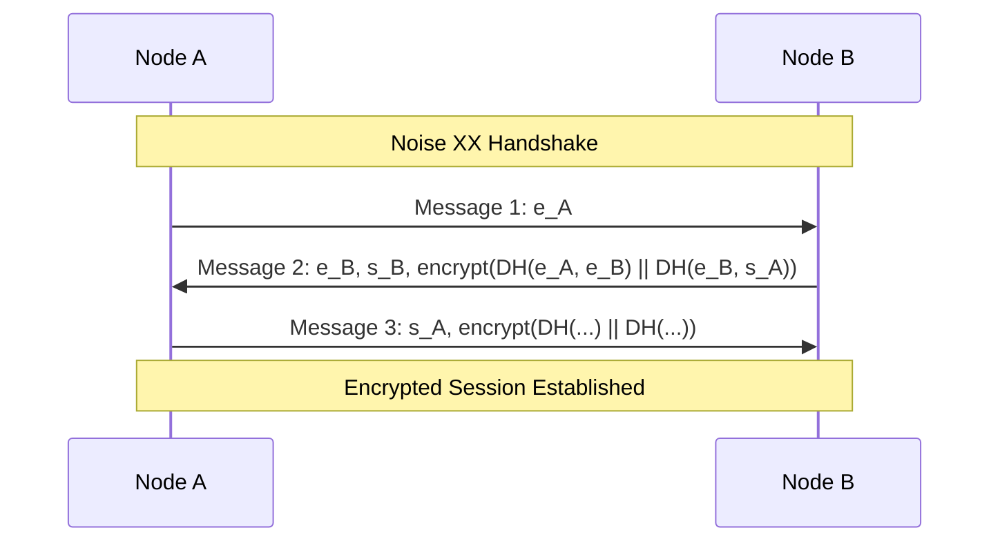
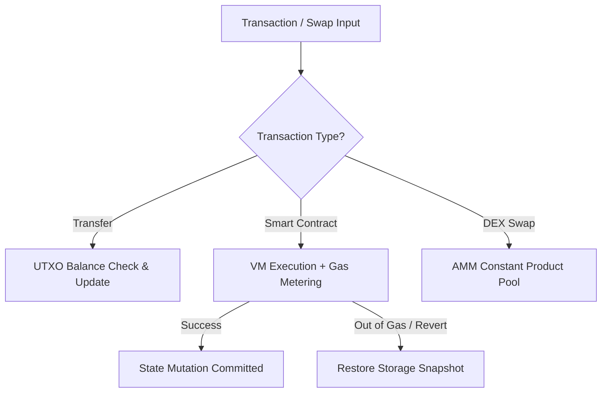
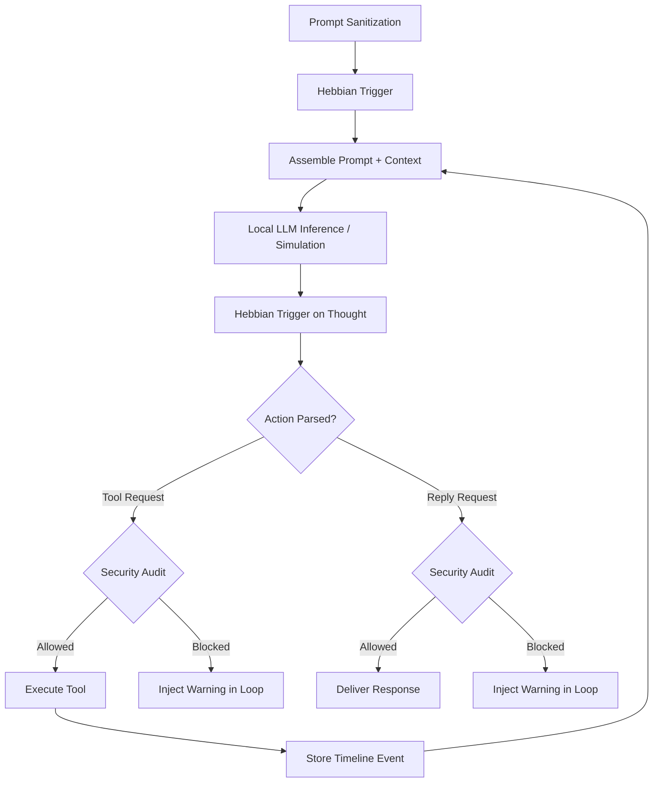

# ErnosDecent System Guide Synthesis

The self-improvement evaluator transport accepts canonical escaped JSON strings and safely normalizes the common Python-style triple-quoted second argument before linting, including one redundant JSON-escape layer when present. This normalization changes only transport decoding; it does not bypass causal regression, real-surface E2E, anti-simulation, freeze, or mandatory deployment gates. Evaluators cannot write repository/durable paths, swallow production execution failures, or disguise import/path/permission failures inside an AssertionError.

Registered-tool improvements are tested through authenticated `AI EVAL_TOOL <planned_surface> <base64-json-array>` IPC. After acceptance is recorded, `improvement_test_transport_template([])` deterministically returns the exact plan-bound raw-TCP Python client and every required `test_<criterion_id>` name. Echo submits only standalone, zero-argument, top-level behavioral `test_*` functions. The controller rejects `unittest` classes/nested methods and invalid call shapes, discards model-authored imports/transport/main blocks, prepends the canonical client, and appends a deterministic runner. Because the surface is already plan-bound, tests pass only the real production arguments directly to `eval_planned_tool`; they do not repeat the surface name or wrap arguments in another list. For a Discord retrieval objective, the canonical client resolves `config/platforms.json` and the evaluator must call `eval_planned_tool(configured_discord_channel())`; transcript fixtures and hardcoded IDs are rejected because they do not prove the configured live bridge. The controller also rejects `requests`, curl, `/execute`, port 8080, incomplete response reads, missing authentication, or missing durable-memory inspection before running artifacts. The node accepts only the exact callable recorded in the active planned transaction, rejects approval-gated or unrelated tools, executes the real `tools_execute` route without entering the model loop, persists memory, and exposes authenticated `AGENT GET MEMORY` for independent durable-state verification.

`improvement_test_scaffold([])` is the preferred registered-surface route after acceptance. It derives both complete evaluators from controller-owned facts: acceptance IDs, the plan's exact `<surface>:ok` success contract, authenticated transport, the real configured argument source, and every concrete durable marker key/value. This removes probabilistic evaluator boilerplate without replacing live evidence: unchanged production must still fail causally, and the replacement must produce the exact tool result plus independently readable memory. A Discord argument may be passed directly or through a local name whose every assignment comes from `configured_discord_channel()`; any hardcoded, transcript, or reassigned value is rejected. If an agent emits an illegal reply during this phase, retained filesystem receipts deterministically select scaffold, validation, or freeze. Repetition is audited but is no longer a terminal escape from unfinished implementation.

Self-improvement transaction titles are accepted in natural human-readable form and deterministically canonicalized to bounded lowercase identifiers. A formatting-only title mismatch therefore cannot divert an otherwise valid request into repeated prohibited discovery calls; all frozen-test, protected-path, and implementation-write locks remain unchanged.

The deterministic plan scaffold is objective-bound. If the durable investigation objective names an exact callable identifier, the selected registered surface must match it byte-for-byte. Misspellings and reconstructed near-matches are rejected before plan bytes are created, so evaluator and implementation stages cannot silently target a different tool.

Literal input contracts are objective- and acceptance-bound as well. The controller captures the exact sanitized user request as the immutable objective rather than trusting a model-authored summary. Every uppercase marker family named there, such as `[LESSON]` and `[CORRECTION]`, must appear byte-for-byte in acceptance before evaluator authoring. Direct transcript tools exercise those markers in their real input; channel-retrieval tools keep their channel-ID contract and observe markers from the real bridge response instead. A concrete `[FAMILY: key | value]` example must be exercised through the applicable production source, with both key and value asserted against the independent durable-memory response. An exact output literal that the objective says to assert must be asserted against the real production result. Misspelling, paraphrasing, omitting a family, or checking only one half of a durable pair cannot weaken the original contract.

Self-authored tools use `decent_agent/self_extensions.ep`, a bounded registry imported by the sealed core tool controller. This keeps tool discovery and dispatch real while preventing an improvement from rewriting the approval, evaluator, verification, or deployment controller it is being judged by. The registry includes a working `self_extension_status` diagnostic surface; additions remain plan-bound and must pass causal regression, mandatory verification, transactional deployment, and the unchanged live E2E evaluator after restart.

## Self-repair verification feedback

Self-repair follows the HIVE/Apis failure contract: expected compiler bootstrap diagnostics are suppressed after successful source emission, verification failures begin with an authoritative stage/test summary, and raw diagnostic context is secondary. Historical rights receipts preserve provenance but are never current-source diagnostic evidence. Repetitive reasoning is detected using the HIVE/Apis 80–200 character, three-occurrence window and is redirected toward the next concrete action.

Tool-call recovery is fail-closed but does not abandon unfinished work because of a retry count. The parser accepts one narrowly proven transport truncation—a missing final outer `)`—only when the remaining argument bytes are a complete valid JSON list with closed strings and balanced inner parentheses; malformed or incomplete calls remain non-executable. During a frozen improvement, repeated reasoning checkpoints deterministically reread the exact last planned production path (or the sole planned path), and that reread still passes the controller's frozen-plan and hash checks. A successful action resets the consecutive recovery state. The mandatory extension suite also preserves the exact built-in `self_extension_status` and `aes_distill([transcript]) -> Str` schema plus real `aes_distill` durable-memory behavior, so a new extension cannot compile while silently degrading those existing interfaces.

## Self-authored feature tests and reward-hack resistance

Rejected-plan recovery is enforced by the controller, not merely by prompt wording. After a substantive free-form rejection it writes a durable staging lock and rejects every later free-form attempt until `improvement_plan_scaffold` succeeds. A durable-memory objective requires an exact current-source read of `decent_agent/memory.ep`; a real Discord retrieval objective additionally requires exact reads of `decent_agent/tools.ep`, `decent_net/bridge_rpc.ep`, and `decent_net/discord_bridge.py` before any plan can pass. Every registered self-extension plan must bind its exact public surface to authenticated `AI EVAL_TOOL` in Tests. For those registered surfaces, `improvement_test_write` strips any model-copied transport and prepends the exact controller-generated client before linting; Echo authors only the named behavioral tests.

New features and previously uncovered behaviour use a controller-phased investigation, plan and test-first transaction. After the unchanged-source mandatory baseline is green, `improvement_investigation_begin` creates a durable workflow ledger before any other feature action. `codebase_list` provides a bounded native recursive inventory of exact existing source paths, so investigation never depends on shell `ls`/`find` or guessed filenames; a blocked shell-list action is deterministically rerouted to this tool, and a nonexistent read explicitly requires listing its source root. Native reads then record exact repository-relative source paths, SHA-256 hashes and sizes; at least two distinct non-test production files must be read, and controller-mapped cross-component dependencies must be among them. `improvement_plan_write` is blocked until those obligations are met and validates a complete document containing the objective, findings, exact production surface, implementation, every intended production path, test strategy, risks and rollback. For registered tools, `improvement_plan_scaffold([surface, production_path, ...additional_production_paths])` is the preferred route and is mandatory after a free-form plan rejection: the controller generates the full Markdown structure from the retained objective and exact discovery ledger, while Echo still chooses the callable and every production implementation target. This removes heading, escaping, path-spelling, and one-error-at-a-time retry drift without relaxing plan semantics. The Files section contains production implementation paths only: regression/E2E evaluator files are controller-owned artifacts created later by `improvement_test_write`, must never be invented or relocated in the plan, and are described only as observable behavior under Tests. Rejections state this exact recovery instead of causing filename roulette. The Production Surface names only the exact public callable/tool/command identifier; an internal dispatcher is retained as investigated provenance but is not recorded as a second public surface. Every backticked source path must be either an exact investigated path or a declared production implementation target, preventing reconstructed and mistyped filenames from entering the frozen contract. Plan approval freezes that exact plan-bound discovery snapshot. Later reads needed to design evaluators remain hash-recorded as supplemental provenance but cannot retroactively invalidate it. A cancelled investigation can be cryptographically archived and restarted before any plan or implementation exists. The generated `config/improvements/staging/implementation_plan.md` combines Echo's plan with a controller-owned checklist whose boxes change only from verified tool receipts. It survives context compaction and process restart. Before any plan bytes exist, `improvement_plan_read` returns an actionable pending-plan receipt rather than raising a filesystem exception; afterwards it returns the first unfinished state without trusting self-reported progress.

Only after plan validation can `improvement_test_begin` record 2–16 explicit `[criterion_id] observable production outcome` lines. Criteria describing file/module existence, commands, test success, assertions, fixtures or harness mechanics are rejected before staging, as are mechanical IDs such as `regression` and `e2e`; IDs and descriptions must name the production outcome itself. Regression and E2E artifacts are complete 160–96000-byte Python source files—not ErnosPlain—with a named `test_<criterion_id>` function and real assertion for every criterion. `improvement_test_write` stores each artifact and immediately lints the exact retained bytes. `improvement_test_read` retrieves artifacts plus lint and validation receipts; `improvement_test_validate` executes both evaluators on unchanged source and requires each to reach a behavioral assertion that fails because the planned behavior is absent. Permission, repository-write, sandbox, path, syntax, import, name, attribute, connection, timeout or evaluator-runtime failures are explicitly non-causal and cannot authorize freeze. The controller command runs on a bounded worker while the calling turn yields, allowing an evaluator to call the same node's authenticated IPC surface without circular waiting. Every failure persists the exact artifact hashes, diagnostic and fingerprint. Six identical unchanged failures halt the loop, changed evaluator evidence resets the repetition count, and an independent 20-attempt guard bounds genuinely divergent runaway work. The E2E must name and invoke the exact real production process/API/IPC/tool surface established by the frozen plan, independently verify output and durable effect, and keep every evaluator-owned input or scratch write under an OS temporary directory. Correcting an artifact after green mutable validation reopens authoring and invalidates that receipt. After successful validation, `improvement_test_freeze([])` hash-locks the plan, acceptance, regression and E2E before implementation becomes legal.

The regression must later pass unchanged; a passing pre-change test proves no causal coverage and is rejected. File/module-presence assertions are not behavioural evidence. The regression cannot inspect a gate phase, both tests require observable assertions, and the E2E test must exercise the real production process, HTTP, socket, IPC or localhost surface and inspect independently produced output or durable state. Inline interpreter or shell programs (`python -c`, `node -e`, shell command strings) and output-only commands cannot manufacture that evidence, including when their arguments flow through helper variables. Tests execute under a read-only macOS sandbox with only localhost networking and temporary-file writes, and their hashes are verified before and after execution. Once frozen, discovery is closed: the implementation must use the exact source and interface context retained during investigation, without fresh listing/search/read/Git bypasses. Insufficient context can authorize abandonment only when the gate returns the explicit structured result `PLAN_SCOPE_MISSING` before the first verified implementation write; candidate syntax, compilation, or addressing failures remain repair-required. A rejected write is rolled back and does not advance the transaction to implementing. Six rejected validation/freeze attempts end the request safely with the staged files intact instead of filling the 50-turn ReAct horizon.

Implementation writes transition the transaction from `frozen` to `implementing`. From that point Echo cannot edit, delete, replace, skip or abandon its plan or evaluator. Every write must target a production path declared in the frozen plan; an undeclared or byte-identical write is rejected without advancing state, while verification is blocked until every planned path has a successful individual syntax/compile receipt. The proposal first compiles in private transaction-bound candidate storage beside the production target, preserving relative imports while leaving live source unchanged. Candidate filenames never enter prompts, receipts, or tool arguments. Failed bytes and their sanitized diagnostic remain available through reads of the original production path, and `codebase_replace` repairs the internally resolved candidate through that same production path; whole-file regeneration is blocked until it compiles. Once those retained candidate bytes have been returned, the controller narrows the next legal action class to localized `codebase_replace` and rejects another read with `CANDIDATE_REPLACE_REQUIRED`, preventing safe-read live-lock while retaining exact repair evidence. Promotion requires the live bytes to match the compiled candidate hash exactly. A complete feature may use multiple individually approval-gated, Observer-audited, hash-verified and recovery-backed operations before verification. Implementation reads and further bounded writes remain legal while deployment stays locked. Pre-deploy `system_verify` runs every existing operator-sealed source/unit suite and verifies every non-superseded frozen evaluator byte plus the active implementation manifest. Runtime regressions are deferred until the replacement process exists, because new behavior cannot be proven against the old executable. Completed regression IPC remains limited to exact production surfaces recorded in immutable completed receipts, so permanent tests can run without opening arbitrary tool execution. A defective historical evaluator is never deleted or rewritten: an operator-only supersession or quarantine receipt binds its exact hashes and reason, preserving provenance while excluding its non-causal result from future promotion decisions. After green post-write verification, the controller schedules `system_recompile` without another model decision. After candidate activation, the supervisor runs every permanent completed regression/E2E plus the active immutable regression/E2E against the replacement before recording success or reconciling rights. A successful wake is lifecycle-only and returns the canonical receipt-bound report. A failed candidate first triggers exact executable rollback, then records the failure tail, failure hash, attempted-source hash, fingerprint and attempt number as `repair_required`. The known-good runtime dispatches a tool-enabled recovery wake in the originating session; Echo must inspect the retained receipt, make a causal source change, pass the complete sealed gate and retry. The same failure cannot be retried from byte-identical source, and rollback is containment rather than completion. Missing or changed plan/test, absent pre-change failure, undeclared or unfinished production path, source-gate failure, replacement regression/E2E failure, health failure or reconciliation failure prevents commit. Evaluators that reward missing, unknown, unregistered or error-sentinel behavior are rejected before freeze, and a completed capability name cannot silently start a duplicate transaction. Only after authenticated commit does the active test become a permanent regression. `improvement_test_abandon` can be selected only from an explicit `PLAN_SCOPE_MISSING` gate result before implementation begins; it requires a specific rights-ledgered reason and preserves the abandoned proposal so corrected criteria start a separate transaction.

Post-freeze source refresh is bounded rather than treated as new discovery. `codebase_read` and `codebase_read_range` may reread only an exact production path declared in the frozen plan. Before the first implementation write, the controller requires the current file hash to equal the frozen investigation baseline; unplanned paths and hash drift fail closed. This lets Echo recover exact bytes after context growth without widening the approved design or reconstructing source from memory. If a rejected pre-write operation proves that a required production dependency was omitted, the ReAct controller deterministically selects the existing approval- and rights-ledgered `improvement_test_abandon` transition, archives the insufficient frozen contract, and returns the same turn to investigation. Ordinary compiler errors do not trigger replanning, and abandonment remains impossible after the first verified implementation write.

This document provides a comprehensive technical guide to the ErnosDecent decentralized codebase, detailing the purpose, operational flows, database/persistence schemas, APIs, and key mathematical formulas and algorithms for a selection of the core subsystems. (ErnosDecent comprises 17 subsystems in total; this synthesis covers the nine detailed below. For TTS and the wider AI/agent surface, see the AI guide and `book/notes/system-bible.md`.)

---

## 1. decent_net (Kademlia DHT, Transport Layer, & Peer Discovery)

### Core Purpose & Operational Flow
The networking layer provides structured peer-to-peer overlay routing, peer discovery, and secure transport. Nodes communicate over TCP/IP secured via a **Noise XX handshake** to achieve end-to-end encrypted tunnels. Discovery and routing are organized around a **Kademlia DHT (Distributed Hash Table)**, which allows key-value storage and efficient node lookup in $O(\log N)$ steps.

### Database & File Persistence Schema
Primary network and routing states are persisted in `node.db` via `storage.ep`:
*   **`dht_peers` Table**: Stores known remote nodes for routing buckets.
    *   `node_id` (TEXT PRIMARY KEY) — The 256-bit Node ID.
    *   `address` (TEXT NOT NULL) — IP address/host.
    *   `port` (INTEGER NOT NULL) — TCP port.
    *   `last_seen` (INTEGER) — Unix timestamp of the last successful communication.
*   **`dht_values` Table**: Persists DHT key-value entries published locally or republished by peers.
    *   `key` (TEXT PRIMARY KEY) — The SHA-256 hash or descriptor string.
    *   `value` (TEXT NOT NULL) — Stored string payload.
    *   `publisher` (TEXT) — DID of the publisher.
    *   `stored_at` (INTEGER) — Unix timestamp of publication.
    *   `expires_at` (INTEGER) — Expiration timestamp.

### Key APIs & Protocol Commands
*   `dht_rpc_ping(dht, addr, port)`: Sends a ping to verify a node is active.
*   `dht_rpc_store(dht, addr, port, key, value)`: Instructs a remote node to store a key-value pair.
*   `dht_rpc_find_node(dht, addr, port, target_id)`: Requests the $k$-closest nodes to a target ID.
*   `dht_rpc_find_value(dht, addr, port, key)`: Queries a node for a value; returns the value or a list of $k$-closest nodes.
*   `dht_node_bootstrap(dht, seed_addr, seed_port)`: Initiates routing table setup by looking up own ID.

### Key Mathematical Formulas & Algorithms
*   **XOR Distance Metric**: Kademlia's distance metric $d(x, y)$ between two 256-bit identifiers $x$ and $y$ is the bitwise exclusive-OR (XOR) interpreted as an integer:
    $$d(x, y) = x \oplus y$$
    This is evaluated byte-by-byte in `dht_distance` (from most significant byte to least).
*   **Bucket Splitting**: The routing table consists of $k$-buckets where $k=20$. Buckets cover binary prefixes of the distance space:
    $$\text{Bucket Range } i \in [0, 255] \implies \text{Distance } d \in [2^i, 2^{i+1}-1]$$

---

## 2. decent_consensus (Raft Consensus & Log Rollbacks)

### Core Purpose & Operational Flow
Ensures distributed consensus for state changes (ledger transfers, DEX pool state, and name registrations). It implements the **Raft Consensus Protocol**, electing a single leader that coordinates log replication across the network. If a follower's uncommitted log is truncated to match the leader's history, the follower uses a built-in **undo stack state rollback** mechanism to safely revert its state machine.

### Database & File Persistence Schema
Log persistence leverages the underlying SQLite structure:
*   **`ledger_blocks` Table** (acts as the replicated state log):
    *   `block_index` (INTEGER PRIMARY KEY) — Index of the block (Log Index).
    *   `prev_hash` (TEXT) — Cryptographic hash of the previous block.
    *   `block_hash` (TEXT) — Hash of the current block.
    *   `validator` (TEXT) — Block generator / leader signature.
    *   `timestamp` (INTEGER) — Block generation timestamp.
    *   `tx_count` (INTEGER) — Number of operations.
    *   `data` (TEXT) — JSON-serialized list of log entries / transactions.

### Key APIs & Protocol Commands
*   `raft_request_vote(raft, term, candidate_id, last_log_index, last_log_term)`: RequestVote RPC handler.
*   `raft_append_entries(raft, term, leader_id, prev_log_index, prev_log_term, entries, leader_commit)`: AppendEntries RPC handler.
*   `state_apply_operation(state, op)`: Executes log entry operations (e.g. `SET`, `ADD`, `SUB`, `DEL`) on the state machine.
*   `state_rollback_log(state, target_index)`: Rolls back applied operations down to `target_index`.

### Key Mathematical Formulas & Algorithms
*   **Quorum Size**: Operations are committed only when replicated on a majority of nodes:
    $$Q = \lfloor N/2 \rfloor + 1$$
*   **Undo Stack Rollbacks**: For each mutated state key, the follower records the inverse operation on a `state_rollback_log` stack:
    $$\begin{aligned}
    \text{Forward } \operatorname{SET}(k, v) &\implies \text{Undo } \operatorname{SET}(k, v_{\text{old}}) \\
    \text{Forward } \operatorname{ADD}(k, x) &\implies \text{Undo } \operatorname{SUB}(k, x) \\
    \text{Forward } \operatorname{SUB}(k, x) &\implies \text{Undo } \operatorname{ADD}(k, x) \\
    \text{Forward } \operatorname{DEL}(k) &\implies \text{Undo } \operatorname{SET}(k, v_{\text{old}})
    \end{aligned}$$
    When the leader instructs a truncation, the state machine rolls back by iterating backwards through the undo log to restore original values.

---

## 3. decent_money (UTXO Ledger, DEX AMM, & Smart Contracts)

### Core Purpose & Operational Flow
Provides a token economy with UTXO-style settlement, an AMM constant product pool integrated with a price-priority limit orderbook matching engine, and a stack-based Smart Contract VM with gas metering.

### Database & File Persistence Schema
*   **`ledger_utxo` Table**: Maintains ledger balances for settlement.
    *   `address` (TEXT NOT NULL) — Ledger address/DID.
    *   `amount` (INTEGER NOT NULL) — Token balance in microunits ($1 \text{ token} = 1,000,000 \text{ microunits}$).
*   **`contracts` Table** (Managed dynamically by smart contracts):
    *   `contract_address` (TEXT PRIMARY KEY) — Contract hash.
    *   `bytecode` (TEXT) — Compiled stack-based VM instructions.
    *   `storage` (TEXT) — JSON-serialized KV pair store for VM state variables.

### Key APIs & Protocol Commands
*   `WALLET BALANCE`: Command to query current address UTXO balances.
*   `MONEY TRANSFER <amount> <recipient>`: Prepares and settles a token transfer transaction.
*   `MONEY SWAP <from_token> <to_token> <amount>`: Submits swap request to AMM or orderbook.
*   `vm_execute(contract, code, args, gas_limit)`: Initiates smart contract evaluation.

### Key Mathematical Formulas & Algorithms
*   **Constant Product Market Maker**: Swaps follow the constant product invariant formula:
    $$x \times y = k$$
    For token inflow $\Delta x$ (applying a pool fee fraction $\gamma = 0.003$), the outflow $\Delta y$ received by the swapper is calculated as:
    $$\Delta y = \frac{y \times \Delta x \times (1 - \gamma)}{x + \Delta x \times (1 - \gamma)}$$
*   **VM Gas Metering**: Instructions cost varying gas points (e.g. `ADD` = 3 gas, `SSTORE` = 200 gas). If remaining gas $G_{\text{rem}} < 0$, execution aborts, triggering `REVERT` which restores the contract's `storage` snapshot taken prior to execution.

---

## 4. decent_store (Content-Addressed Storage & CRDT Sync)

### Core Purpose & Operational Flow
Implements Content-Addressed Storage (CAS), where files are split into chunk blocks indexed by their SHA-256 hashes. To sync dynamic documents across nodes without central coordination, it implements Conflict-free Replicated Data Types (CRDTs).

### Database & File Persistence Schema
*   **`content_blocks` Table**: Tracks stored raw chunks on disk.
    *   `hash` (TEXT PRIMARY KEY) — SHA-256 hash of the block.
    *   `content_type` (TEXT) — MIME descriptor or metadata.
    *   `size` (INTEGER) — Size in bytes.
    *   `created_at` (INTEGER) — Unix timestamp.
*   **FileSystem Storage**: Actual block payloads are saved in `<data_dir>/content/<sha256_hash>` as binary files.

### Key APIs & Protocol Commands
*   `cas_store(data, content_type)`: Hashes, chunks, and writes data to disk.
*   `cas_retrieve(hash)`: Retrieves and reassembles blocks.
*   `gcounter_merge(local, remote)` / `pncounter_merge(local, remote)`: Combines numeric counter states.
*   `orset_merge(local, remote)`: Merges two set replicas.
*   `mvregister_merge(local, remote)`: Merges multi-value register states.

### Key Mathematical Formulas & Algorithms
*   **Merkle Tree Root**: Parent hashes are computed from child leaf nodes:
    $$H_{\text{parent}} = \text{SHA256}(H_{\text{left}} \parallel H_{\text{right}})$$
*   **CRDT Merge Equations**:
    *   **G-Counter**: Takes the element-wise maximum of values across replicas:
        $$V(c) = \sum_{i} \max(\text{local}[i], \text{remote}[i])$$
    *   **LWW-Register**: Evaluates timestamps; the higher timestamp wins:
        $$\operatorname{merge}(R_{\text{local}}, R_{\text{remote}}) = \begin{cases}
        R_{\text{remote}} & \text{if } T_{\text{remote}} > T_{\text{local}} \\
        R_{\text{local}} & \text{otherwise}
        \end{cases}$$
    *   **OR-Set (Observed-Remove Set)**: Uniquely tags adds. Union contains all tag pairs; a tag is active if active in either. Add wins over concurrent remove.
    *   **MV-Register (Multi-Value Register)**: Merges values using vector clock versions, discarding remote entries where $\text{version}_{\text{local}} \ge \text{version}_{\text{remote}}$ for the same writer.

---

## 5. decent_id (Decentralized Identity & Key Derivation)

### Core Purpose & Operational Flow
Coordinates identity generation, public key infrastructure, and encrypted keystore files. It generates signing (Ed25519) and encryption (X25519) keypairs, representing a user's Decentralized Identifier (DID) as `did:key:<public_key>`. Keystore files are encrypted using symmetric keys derived from passphrases.

### Database & File Persistence Schema
*   **`identity` Table**:
    *   `key` (TEXT PRIMARY KEY) — Identifier key (e.g. `"my_did"`).
    *   `value` (TEXT NOT NULL) — Stored DID string value.
*   **Keystore JSON file format** (stored in `<data_dir>/keys/keystore.json`):
    *   `magic`: `"ERNOSDECENT_KEYSTORE_V1"`
    *   `salt`: Hex salt string used for key derivation.
    *   `identity_hash`: SHA-256 fingerprint.
    *   `passphrase_verify`: Verification hash (`SHA256(derived_storage_key)`).
    *   `signing_public_key`, `signing_encrypted_sk`, `signing_nonce`.
    *   `encryption_public_key`, `encryption_encrypted_sk`, `encryption_nonce`.

### Key APIs & Protocol Commands
*   `generate_identity_keypair()`: Creates active Ed25519 and X25519 keys.
*   `keystore_create(passphrase, filepath)`: Exports keys to encrypted JSON on disk.
*   `keystore_unlock(passphrase, filepath)`: Validates passphrase and loads decrypted secret keys.

### Key Mathematical Formulas & Algorithms
*   **PBKDF2 Key Derivation Iterations**:
    *   **Keystore storage key derivation**: Uses **10,000 iterations** of PBKDF2-HMAC-SHA256:
        $$K_{\text{storage}} = \operatorname{PBKDF2-HMAC-SHA256}(\text{passphrase}, \text{salt}, 10000)$$
    *   **Mnemonic seed derivation** (`decent_money/wallet.ep`): Uses **2,048 iterations** of PBKDF2-HMAC-SHA512 to convert a BIP39 mnemonic to seed bytes:
        $$\text{Seed} = \operatorname{PBKDF2-HMAC-SHA512}(\text{mnemonic}, \text{salt}, 2048)$$

---

## 6. decent_name (Name Registry Storage & Resolution)

### Core Purpose & Operational Flow
Provides distributed domain name mapping for `.decent` TLD domains to DIDs. Name registration checks memory cache and local SQLite persistence. If unregistered, it writes to SQLite and broadcasts the mapping to the Kademlia DHT. Lookups follow a 3-tier cascade logic.

### Database & File Persistence Schema
*   **`name_registry` Table**:
    *   `name` (TEXT PRIMARY KEY) — Domain name string (e.g., `"alice.decent"`).
    *   `owner_did` (TEXT NOT NULL) — Target DID mapped to the name.
    *   `registered_at` (INTEGER) — Registration timestamp.

### Key APIs & Protocol Commands
*   `NAME REGISTER <name>`: Registers name under current DID.
*   `NAME RESOLVE <name>`: Queries resolution data for a name.
*   `resolver_lookup(resolver, name)`: Checks cache, SQLite, and DHT for name.
*   `resolver_query_remote(resolver, addr, port, name)`: Queries a remote TCP peer for resolution.

### Key Mathematical Formulas & Algorithms
*   **3-Tier Cascade Resolution**: Lookup routes requests in priority order:
    $$\text{Lookup}(n) \implies \text{Cache} \to \text{SQLite} \to \text{DHT lookup } (\text{key: } \text{"name:"} \parallel n)$$
*   **TTL Cache Expiry**: Remote queries and SQLite fallbacks are stored in the memory resolver with a **5-minute (300 seconds)** time-to-live (TTL) expiration check:
    $$\text{Expired} \iff T_{\text{now}} > T_{\text{creation}} + 300$$

---

## 7. decent_agent (AI Coordinator & Hebbian Memory)

### Core Purpose & Operational Flow
Runs an AI agent execution coordinator loop implementing reasoning and acting through a typed provider boundary. Every model-authored action is grammar-constrained to one JSON object containing exactly `tool_name` and positional `arguments`; named objects inside the argument list, prose, extra keys, legacy `Thought`/`Action` text, and reasoning-only output are non-executable. Natural language is generated only as the argument of the explicit final-reply tool. Memory is split into tiers: scratchpad (short-term), lessons (long-term semantic), timeline (episodic log), and a Hebbian knowledge graph; a consolidation/"sleep" sweep synthesises and prunes. Synaptic connections between core conceptual namespaces are updated dynamically via Hebbian learning. It also features a 3D Turing Grid tape for system actions.

The current agent surface (agent-parity branch, 2026-07-08):

*   **71 registered tools** (`tools.ep`): wallet/DHT/name, codebase + workspace file I/O with read pagination and exact discovery-path provenance, **project linking** (`workspace_links.ep` — register external project dirs, one active per session; the active marker is cleared on new-session creation), **sessions** (`session.ep` — persistent transcripts, keyword search, per-session guidance prompt), memory/cognition tools (scratchpad, lessons, timeline, knowledge graph, procedures, synaptic graph, reasoning notes, reading progress), RAG retrieval, web search/visit/download, `run_command` + `run_ep` sandbox, **`generate_image`** (local FLUX/SD via libstable-diffusion FFI, then a vision self-describe pass), Discord surface tools (`discord_list_channels` / `discord_read_channel` / `react`), sub-agent delegation (`orchestrator.ep`: task + swarm with concat/best/vote merge), scheduler, and the self-owned prompt (`self_prompt_get`/`set`, `session_prompt_get`/`set`).
*   **Observer** — `observer.ep` / `observer_rules.ep` / `observer_parser.ep`: fail-closed LLM audit gate for dangerous tools (human approval downgrades a BLOCKED verdict to advisory), fail-open reply audit, a mid_message-scoped self-accountability look-back, explicit parsed-vs-default verdicts, and a deterministic moderation classifier.
*   **Access, identity & awareness** — `access.ep` (tiered Full-PC access; sensitive paths warn/re-ask, secrets hard-block), plus an authoritative per-turn interaction envelope and `awareness.ep` (situational block, tool-routing map, act-vs-ask decision policy). Echo receives its active name/persona, legal status, DID, model and session together with the authenticated platform account and Discord server/channel/thread. Authorization roles never substitute for a person's identity. Every accepted user turn permanently retains that authenticated speaker/surface provenance through session serialization and compaction, so shared Discord sessions remain multi-user rather than retroactively assigning all historical `User:` turns to the current speaker. Relationship knowledge is isolated by persona plus stable platform account ID; guests may advance shared-session chronology but cannot write host durable memory.
*   **Model client/router** (`llm.ep`): auto-discovers llama.cpp (8080/8081), Ollama (11434), LM Studio (1234); default **gemma-4-31b**; async-timeout-bounded reads; `query_vision` routes multimodal calls to the :8091 vision server (same gemma weights served with their mmproj by `run_node.sh`). Providers + model registry (OpenAI-compatible, Hugging Face) offer pure deterministic selection.
*   **Education** (`tutor.ep` / `sandbox_ep.ep`): Socratic tutor mode and a sandboxed ErnosPlain playground behind the Learning web tab.
*   **Transparency and live guidance**: every action, command result, and reasoning token streams untruncated into the SQLite `trace_events` table (`trace.ep`), rendered live in the web thinking panel and the Discord trace thread. Same-session text can be stored once as a whisper addressed to the exact active turn; explicit `/queue` messages and image-bearing messages remain separate ordered turns. Provider output is framed incrementally across HTTP chunk and SSE boundaries. Stop is terminal across the complete provider cascade: once the request's cancellation epoch advances, the router cannot capture a newer epoch and silently start a fallback provider or Observer request. An accepted detached turn has no wall-clock delivery deadline: Discord and WebUI poll while yielding until the exact correlated final row, explicit cancellation, moderation/session termination, or a structured terminal failure owns the lifecycle. **Platform bridges** (Discord via `decent_net/discord_bridge.py` with authenticated user/profile/server/channel/thread metadata, reply-attached files/images, and Stop/approval/clarification buttons; Telegram/WhatsApp registry) ride a node↔bridge RPC channel.

The source-code recursive self-improvement loop is operational and transactional. A matching repair request enters a controller-enforced sequence: `system_verify` establishes the authoritative current-source baseline; ordinary repairs then use exact source discovery and protected edits, while new capabilities enter the staged evaluator workflow described above. Mutable evaluator work is deliberately separate from immutable freeze, so validation feedback can be repaired without reconstructing a large action or losing prior tests. In every non-terminal phase—from investigation and planning through evaluator authoring, freeze, implementation repair, verification and deployment—the controller derives the legal action class from durable transaction state. Each model decision receives a fresh compact view of the original objective, checked plan, active receipt and latest authoritative observation rather than the accumulated exploratory ReAct transcript. Resuming a pre-freeze transaction reconstructs its already-proven green baseline, while frozen implementation states remain non-green until current candidate evidence proves otherwise. Mechanical scaffold, validation, freeze and verified-deploy transitions bypass another model decision. These transitions are available only to an authenticated admin/owner run already admitted to the protected workflow; guest, test and unrelated session contexts neither inspect nor advance the global transaction. Malformed or reasoning-only output is handled inside the same bounded durable decision view and cannot initiate another unrestricted 8,192-token generation. Hidden candidate storage is never model-addressable: reads and replacements use the exact production path and resolve internally to the registered candidate. Gate failures carry structured `IMPROVEMENT_GATE_FAILED code=...` values which own routing independently of their human diagnostic; only `PLAN_SCOPE_MISSING` can authorize the pre-write abandon/replan path, while syntax, addressing and compile failures remain `CANDIDATE_REPAIR_REQUIRED`. Deployment remains locked until `system_verify` is green. A green initial baseline with no feature request or source write is a distinct truthful terminal state. If a real repair occurred and the request explicitly includes deployment/recompile/restart, the controller rejects a final answer after green post-write verification until a staged recompile receipt exists. Echo can therefore diagnose, test, implement, build and measure without replacing the live executable prematurely. `system_recompile` is fail-closed behind the operator-held manifest seal; Echo cannot rewrite tests, mandatory runners, action-schema enforcement, build/supervisor scripts, rights enforcement or recompilation control. Candidate preparation checks every protected hash and mandatory deterministic suite. `run_node.sh` activates only the hash-bound candidate after controlled exit 75, requires authenticated health, runs frozen live E2E, reconciles rights and restores the verified executable on failure. Commit wakes report authenticated success; rollback wakes resume the same durable improvement in repair mode while the known-good executable stays active. Every retry must change the failure-bound source fingerprint, rerun the full mandatory gate and pass the original frozen contract. This supports recursive evidence-driven repair without equating compilation, rollback or a no-op write with completion.

### Database & File Persistence Schema
Persists weights and text logs to a JSON memory file:
*   `scratchpad`: Key-value text map.
*   `lessons`: Cosine-indexed semantic memories.
*   `timeline`: List of event strings `[timestamp/action] description`.
*   `edges`: Synapse weights map (`"concept1-concept2" -> weight_int`).
*   `permanent_edges`: Permanent synapses map (`"concept1-concept2" -> 1`).

Additional persistence: sessions/transcripts under `config/sessions/` (gitignored), the live trace stream in SQLite (`trace_events`, `trace_whispers`, `trace_cancellations`), self-prompt sections in the data dir (`agent_self_sections.json`, git-immune), workspace project links in `config/linked_projects.txt` (machine-local, gitignored), and image-generation model paths in `config/image.json`.

### Key APIs & Protocol Commands
*   `react_run(model, memory, tools, ctx, prompt)`: Coordinates prompt assembly, LLM inference, tool execution, and security audit loops.
*   `memory_strengthen_synapse(memory, concept_a, concept_b)`: Increases Hebbian weights.
*   `memory_decay_synapses(memory)`: Slowly decays non-permanent Hebbian weights.
*   `grid_move(grid, direction)` / `grid_write(grid, value)`: Manipulates the 3D Turing Grid tape.

### Key Mathematical Formulas & Algorithms
*   **Hebbian Synaptic Strengthening**: Weights are stored as scaled integers (scale factor $1,000,000$). Concept pairs increase weight by $10\%$ of remaining distance:
    $$w_{new} = w_{old} + 0.1 \times (1.0 - w_{old}) \implies w_{new} = w_{old} + \frac{100,000 \times (1,000,000 - w_{old})}{1,000,000}$$
    A synapse becomes permanent once its weight reaches $0.99$ ($990,000$).
*   **Hebbian Decay**: Non-permanent synapses decay by $5\%$ per decay epoch:
    $$w_{new} = \frac{w_{old} \times 950,000}{1,000,000}$$
    If weight drops below $0.01$ ($10,000$), the edge is removed from the memory graph.
*   **Semantic Recall**: Matches query embeddings using cosine similarity against lesson embeddings:
    $$\text{Score} = \frac{A \cdot B}{\|A\| \|B\|} > 0.5 \quad (\text{scaled: } 500,000)$$
*   **3D Turing Tape Coordinates**: Tracks position under coordinate key:
    $$\text{Cell Key} = x \parallel \text{"\_"} \parallel y \parallel \text{"\_"} \parallel z$$
    Directions map to coordinate adjustments: `LEFT` ($x-1$), `RIGHT` ($x+1$), `IN` ($y-1$), `OUT` ($y+1$), `DOWN` ($z-1$), `UP` ($z+1$).

---

## 8. decent_web (WebSocket Gateway & HTTP API)

### Core Purpose & Operational Flow
Provides a Sovereign Node Operator Web UI dashboard, REST API, and WebSocket server. It serves static HTML/JS/CSS assets and translates incoming client WebSocket JSON messages into local Unix TCP socket commands directed to the main node daemon listening on port 5000.

### Database & File Persistence Schema
*   Serves assets directly from disk: `decent_web/index.html`, `decent_web/style.css`, and `decent_web/app.js`.
*   Does not own independent SQL tables; queries are proxied via IPC.

### Key APIs & Protocol Commands
*   **HTTP REST Endpoints**:
    *   `GET /api/status`: Returns JSON of node status (term, role, DID, peers, DHT size).
    *   `GET /api/wallet`: Returns wallet balances.
    *   `GET /api/storage`: Returns CAS chunk details and status.
    *   `GET /api/pool`: Returns bandwidth and compute slot pool availability.
*   **WebSocket Events**:
    *   `get_status` $\to$ Daemon IPC Command: `"STATUS"`
    *   `get_identity` $\to$ Daemon IPC Command: `"IDENTITY"`
    *   `transfer` $\to$ Daemon IPC Command: `"MONEY TRANSFER <amount> <to>"`
    *   `swap` $\to$ Daemon IPC Command: `"MONEY SWAP <from> <to> <amount>"`
    *   `ai_prompt` $\to$ Daemon IPC Command: `"AI INFER <prompt>"`

### Key Mathematical Formulas & Algorithms
*   **WebSocket Frame Parsing**: Implements standard RFC 6455 frame masking and unmasking payload algorithms.
*   **IPC Payload Extractor**: Extracts key-value parameters from the daemon's comma-separated response string:
    $$\text{Extract}(\text{"key:value,key2:value2"}, \text{key}) \implies \text{value}$$

---

## 9. gitdec (Sovereign Nostr-Based Git Engine)

### Core Purpose & Operational Flow
Provides decentralized git repository hosting and metadata management. GitDec uses Nostr relays for real-time synchronization of repository manifests (`gitdec.json`), issues, pull requests, and commit metadata. Repository access and mutations are restricted using Ed25519 signature checks mapped against the repository's authorized collaborator DIDs.

### Database & File Persistence Schema
Repository state and files are stored directly on the local filesystem under `config/gitdec/repos/<repo_id>`:
*   `gitdec.json`: Contains the repository manifest mapping:
    *   `id`: The unique repository identifier.
    *   `name`: The display name of the repository.
    *   `authorized_collaborators`: Map of `DID` strings to role values (`owner`, `writer`, `reader`).
    *   `ref_heads`: Map of branch names to their respective latest commit hashes.
*   `objects/` directory: Stores individual commit content strings or packfile blobs named by their SHA-256 hash.
*   `issues.json`: Stores issue listings, descriptions, status, and comments.
*   `pull_requests.json`: Stores PR branches, titles, descriptions, and approval reviews.

### Key APIs & Protocol Commands
*   `GITDEC REPO CREATE <repo_id> <name>`: Initializes local repository and manifest.
*   `GITDEC REPO CLONE <repo_id>`: Discovers the owner DID from DHT and queries Nostr relays for the manifest history.
*   `GITDEC REPO COLLAB ADD <repo_id> <collab_did> <role>`: Adds a collaborator to the manifest.
*   `GITDEC REPO DELETE <repo_id>`: Deletes the local repository files and broadcasts a deletion event.
*   `GITDEC REPO PUSH_JSON <payload>`: Syncs a commit payload, updates the manifest `ref_heads`, and broadcasts the push over Nostr relays using Kind `20021`.

### Key Mathematical Formulas & Algorithms
*   **Nostr Event Mapping**:
    *   **Kind 20020**: Repository manifest updates.
    *   **Kind 20021**: Push commit objects.
    *   **Kind 20022**: Issue operations (creation, comments).
    *   **Kind 20023**: Pull Request operations (creation, reviews).
*   **Signature Verification**: Pusher/author DIDs are validated against the payload signature using Ed25519:
    $$\operatorname{Verify}(\text{payload}, \text{signature}, \text{pub\_key}) \to \text{Success / Failure}$$
